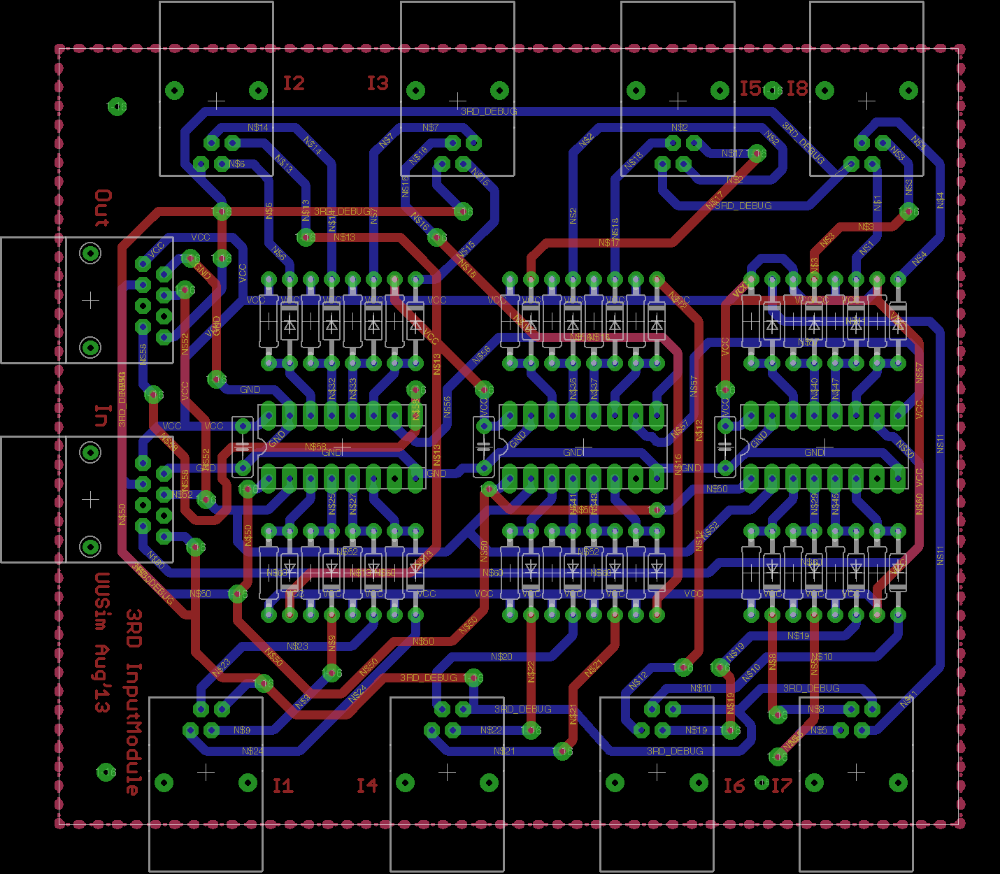

# InputModule
PCB designs of the Input module of the S88 train detection bus. This is the master board. It uses 3 74hc165 ICs, resulting in 24 inputs. The master boards can be chained together via RJ45 connectors. Each RJ11 connector on the master board serves a group of 3 inputs, which are connected via a slave board.
